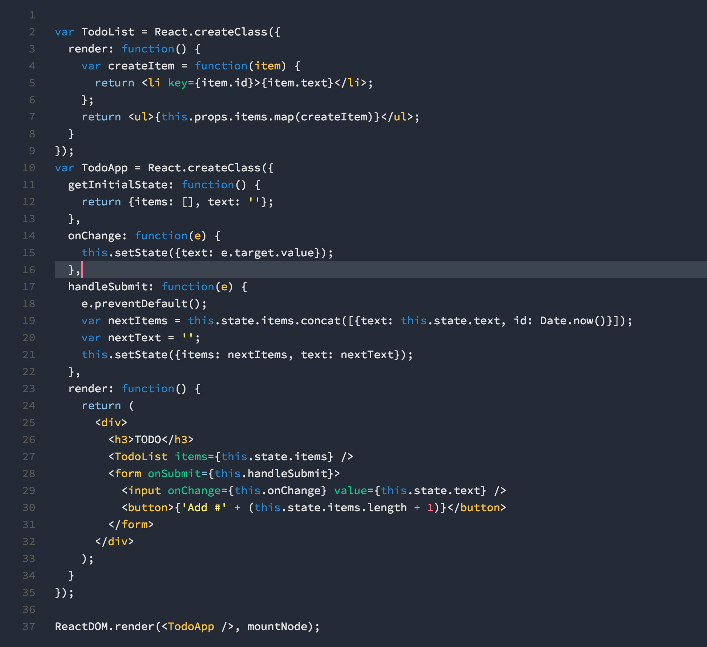

# Chester Color Scheme

## Visual Studio Code extension "theme-chester"

You can install this theme by installing from Visual Studio Code Marketplace, from within vscode use ⌘+⇧+P (command-shift-p) and then "Install Extenstion", searching for "Chester".

You can also copy the folder the `theme-chester` folder to your vscode config directory, on Mac/Linux it is `~/.vscode/extensions`

The theme is based off the work done by Chris Sutter, specifically his [chester-atom-syntax](https://github.com/csutter/chester-atom-syntax).

Here's a screen shot of it in action:

